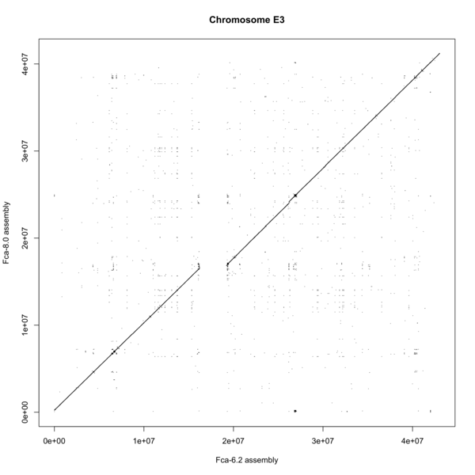

# Comparing Felis_catus-6.2 and Felis_catus_8.0 assemblies

To date, two assemblies of the domestic cat genome (*Felis catus*) are
publicly available:

- [Felis_catus-6.2](http://www.ncbi.nlm.nih.gov/assembly/320798),
- [Felis_catus_8.0](http://www.ncbi.nlm.nih.gov/assembly/1373248).

The Felis_catus_8.0 assembly (further called *Fca-8.0*) is based on the
same reads as the Felis_catus-6.2 assembly (further called *Fca-6.2*)
plus Illumina 20x reads.

To compare the assemblies, we aligned their masked chromosome sequences to each
other using the
[**LASTZ**](http://www.bx.psu.edu/miller_lab/dist/README.lastz-1.02.00/README.lastz-1.02.00a.html)
whole-genome aligner. 

## Repeat masking

Prior to aligning, we masked both assemblies with
the following repeat-masking tools:

- **RepeatMasker** for interspersed repeats;
- **trfBig** for tandem repeats;
- **DustMasker** for low-complexity sequence regions.

**RepeatMasker** was launched with the options `-species
cat -nolow`; **trfBig** and **DustMasker** were launched with their
default options.

## Chromosome alignment and visualization

The assemblies were split into single FASTA files for each chromosome.
The pairs of FASTA files corresponding to the same chromosome were
aligned to each other using **LASTZ** with the following options:
`--nogapped --notransition --step=20 --format=rdotplot`. *Fca-6.2*
chromosomes were used as targets and *Fca-8.0* as queries.

Dot plots were drawn for the obtained alignments using [an in-house R
script](http://t.co/XHn113jVv7).

From dot plots, one may conclude that the following chromosomes show
somewhat significant differences between *Fca-6.2* and *Fca-8.0*
assemblies:

- A1;
- A3;
- B1;
- C2;
- D3;
- D4.

Dotplots of the chromosomes that show significant and moderate
differences between the assemblies are given in the subsections below.

### Significantly different chromosomes

### Moderately different chromosomes

